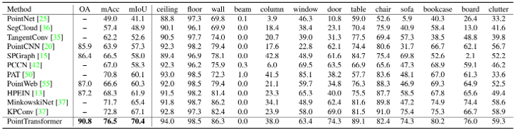
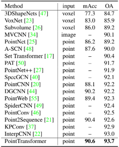
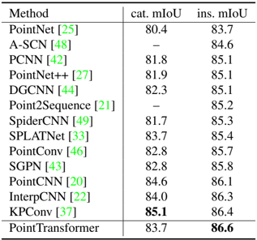
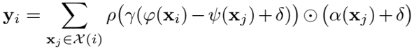
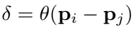
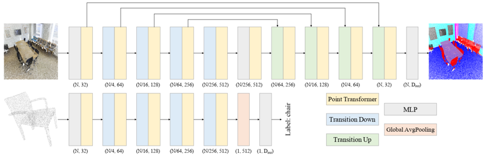
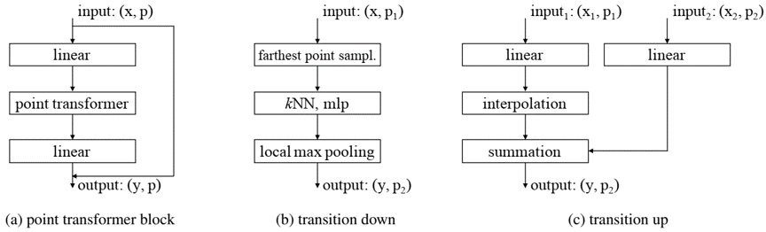

# 2020
* **Point Transformer V1** (**PTv1**)
  * title and link: [Point Transformer](https://arxiv.org/abs/2012.09164)
  * information: 2020.12.16 ICCV 2021 oral HKU
  * problem and position: first attempt for Transformer backbone on point clouds
  * method overview: just self-attention layers on point tokens
  * results: 
    
  * method details: 
    * each point as a token
    * vector self-attention within k nearest neighbors
      
    * positional encoding by MLP on point coordinates
      
    
    
