# 2022
* **Robotics Transformer 1** (**RT-1**)
  * title and link: [RT-1: Robotics Transformer for Real-World Control at Scale](https://arxiv.org/abs/2212.06817)
  * information: 2022.12.16 Arxiv Google (Chelsea Finn, Sergey Levine)
  * problem and position: first attempt to brute-force general robot manipulation
  * method overview: large real-world data and Transformer-based model
  * results: 
    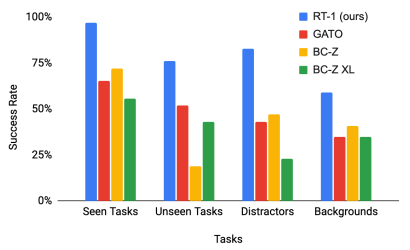
    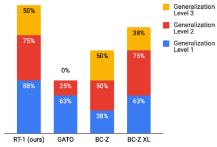
  * method details: 
    * training dataset with ~130k episodes over 700+ tasks, collected for 17 months with 13 robots
    * open-source
    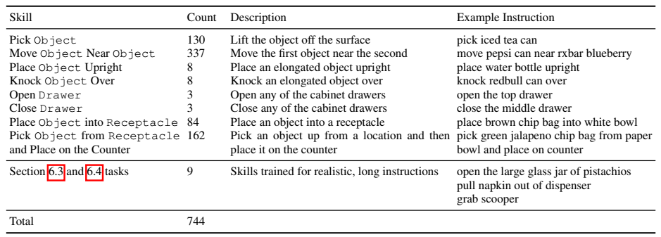
    * input 6 images and language instructions and output robot actions
    * image tokenized by ImageNet-pretrained EfficientNet-B3 into $9 \times 9 \times 512 \rightarrow 81 \times 512$
    * instruction tokenized by Universal Sentence Encoder into $512$ embedding
    * FiLM layers condition instruction embedding to image tokenizer
    * TokenLearner as element-wise attention map 81 to 8 tokens to speed up inference
    * decoder-only Transformer
    * 35M parameters, 3Hz, open-source
    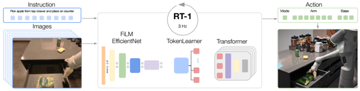
    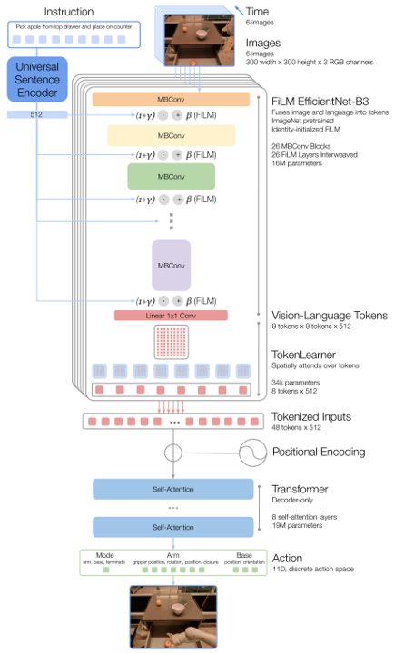

* **Point Transformer V2** (**PTv2**)
  * title and link: [Point Transformer V2: Grouped Vector Attention and Partition-based Pooling](https://arxiv.org/abs/2210.05666)
  * information: 2022.10.12 NeurIPS 2022 HKU
  * problem and position: improve PTv1
  * method overview: group vector attention, position encoding multiplier, partition-based pooling
  * results: 
    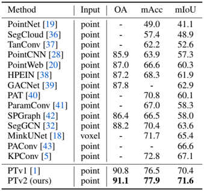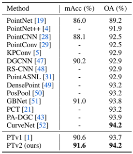
  * method details: 
    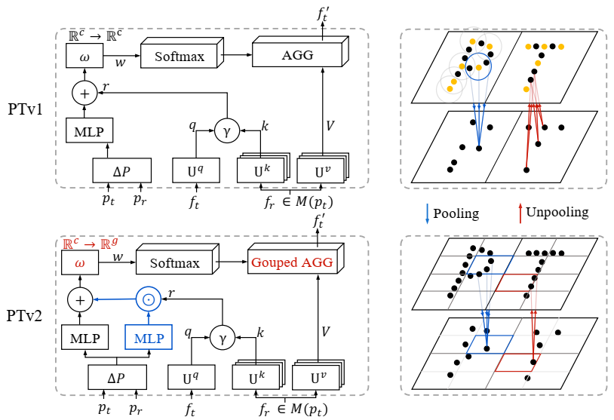
    * group vector attention: divide channels of the value into groups, weight decoding layer outputs weights for each group, channel within the same group share the same weight
    * position encoding multiplier: additional learnable scale factor
      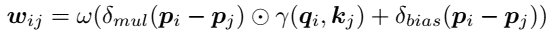
    * partition-based pooling: uniform grids instead of FPS and kNN

* **do as i Can not as i Say** (**SayCan**)
  * information: 2022.08.16 CoRL 2022 special innovation paper Google (Chelsea Finn, Sergey Levine)
  * see [honors](https://github.com/dadadadawjb/honors)

* **Reusable Representation for Robotic Manipulation** (**R3M**)
  * title and link: [R3M: A Universal Visual Representation for Robot Manipulation](https://arxiv.org/abs/2203.12601)
  * information: 2022.03.23 CoRL 2022 Stanford (Chelsea Finn, Abhinav Gupta)
  * problem and position: visual representation pre-trained on human videos for robot learning
  * method overview: time-contrastive loss, video-language alignment loss and L1/L2 regularization loss to train ResNet encoder on Ego4D human videos
  * teaser: 
    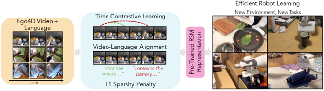
  * results: improve 20% than from scratch and 10% than CLIP on 12 tasks
    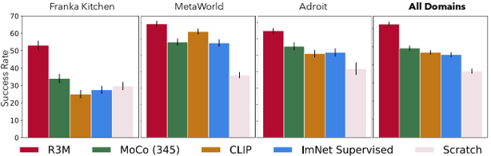
    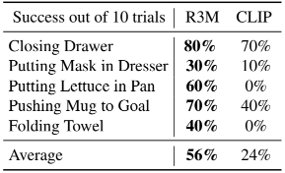
  * method details: 
    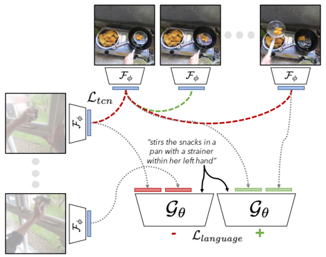
    * pre-train on Ego4D human videos
    * time-contrastive loss to capture temporal dynamics
      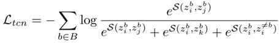
    * video-language alignment loss to capture semantically relevant features
      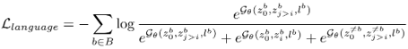
    * L1 and L2 regularization loss to encourage compact
    * use ResNet18, ResNet34 and ResNet50
