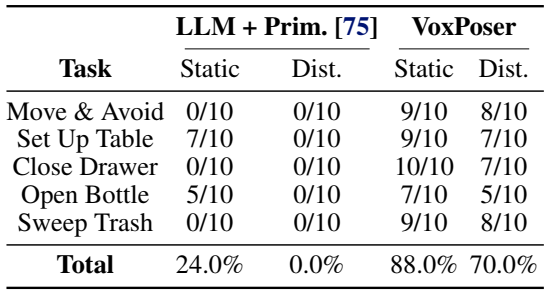
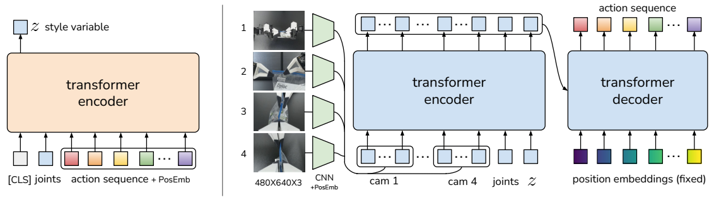
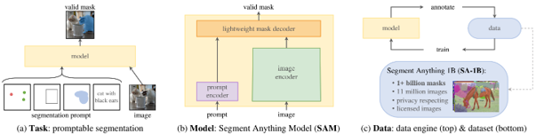
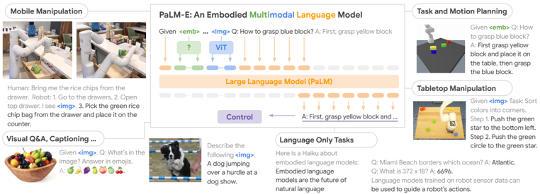

# 2023
* **video Generative pre-training for Robot 1** (**GR-1**)
  * title and link: [Unleashing Large-Scale Video Generative Pre-training for Visual Robot Manipulation](https://arxiv.org/abs/2312.13139)
  * information: 2023.12.20 ICLR 2024 ByteDance (Hang Li, Tao Kong)
  * problem and position: video generative pre-training for robot manipulation
  * method overview: language conditioned video prediction pre-train, robot data fine-tune
  * teaser: 
    
  * results: 
    
    
  * method details: 
    
    * frozen CLIP as language encoder
    * frozen MAE-pretrained ViT as image encoder
    * MLP for robot state encoder
    * causal transformer to fuse different modalities token sequence
      
      
    * self-attention for future image decoder
    * MLP for robot action decoder
    * video prediction pre-train on Ego4D, finetune on robot data

* **Diffusion Policy** (**Diffusion-Policy**)
  * title and link: [Diffusion Policy: Visuomotor Policy Learning via Action Diffusion](https://arxiv.org/abs/2303.04137)
  * information: 2023.12.05 RSS 2023 Columbia (Shuran Song)
  * problem and position: diffusion model on robotics action imitation learning
  * method overview: empirical attempt for diffusion policy
  * results: 15 tasks from 4 benchmarks in simulation with 46.9% improvement, and many real-world experiments
    
    
  * method details: 
    * diffusion advantages
      * multimodal action distributions
      * high-dimensional action space and sequence
      * stable training
      
    
    * DDPM action sequence with receding-horizon control to maintain temporal consistency
    * visual observation as conditioning
    * Transformer-based
    * position control
    

* **Robotics Transformer X** (**RT-X**)
  * information: 2023.10.04 ICRA 2024 best paper 44 institutions
  * see [honors](https://github.com/dadadadawjb/honors)

* **Robotics Transformer 2** (**RT-2**)
  * title and link: [RT-2: Vision-Language-Action Models Transfer Web Knowledge to Robotic Control](https://arxiv.org/abs/2307.15818)
  * information: 2023.07.28 Arxiv DeepMind (Chelsea Finn, Sergey Levine)
  * problem and position: leverage large pretrained VLM to generate actions directly
  * method overview: tokenize robot action as if text tokens, finetune with pretrained VLM
  * results: still limited to seen skills
    
    
  * method details: 
    * pretrained VLM PaLI-X and PaLM-E
    * action representation as RT-1, map to tokens according to VLM’s tokenization
    * co-finetune robotics data with original vision-language data instead of robotics data only
    * robotics data from RT-1
    * 55B parameters, 3Hz, deployed in cloud server and query through network, not open-source
    

* **Voxel Composer** (**VoxPoser**)
  * title and link: [VoxPoser: Composable 3D Value Maps for Robotic Manipulation with Language Models](https://arxiv.org/abs/2307.05973)
  * information: 2023.07.11 CoRL 2023 oral Stanford (Jiajun Wu, Li Fei-Fei)
  * problem and position: directly generate robot trajectories zero-shot
  * method overview: LLM writes codes to call VLM to estimate 3D value maps and then optimize to robot trajectories
  * results: 
    
  * method details: 
    * ChatGPT-4 writes codes to generate voxel maps
    * codes call OWL-ViT, SAM and XMEM to bbox, mask and video mask
    * compose affordance map and constraint map into value map, unknown how to derive the rotation map, gripper map and velocity map
    * randomly sample trajectories and score them according to the value map
    

* **A Low-cost Open-source HArdware** (**ALOHA**)
  * title and link: [Learning Fine-Grained Bimanual Manipulation with Low-Cost Hardware](https://arxiv.org/abs/2304.13705)
  * information: 2023.04.23 RSS 2023 Stanford (Sergey Levine, Chelsea Finn)
  * problem and position: learning fine-grained bimanual manipulation with low-cost hardware
  * method overview: bimanual teleoperation hardware and Action Chunking with Transformers model
  * results: 
    
  * method details: 
    * hardware
      * ViperX 6DoF arms with 3D-printed grippers
      * teleoperate by direct joint-space mapping from smaller WidowX
      * open-source, cost 20k dollars
      
    * Action Chunking with Transformers (ACT)
      * action chunking: predict actions $k$ timesteps instead of one for temporal correlation
      * temporal ensembling: average across overlapping action chunks for smoothness
      * Transformer model + CVAE training for multimodality
      * 80M parameters, train from scratch for each task
      
      

* **Segment Anything Model** (**SAM**)
  * title and link: [Segment Anything](https://arxiv.org/abs/2304.02643)
  * information: 2023.04.07 ICCV 2023 best paper honorable mention Meta (Ross Girshick)
  * problem and position: foundation model for image segmentation
  * method overview: define promptable segmentation task, semi-automatic collect largest dataset, train a model
  * teaser: 
    
  * results: impressive zero-shot
    
  * method details: 
    * promptable segmentation task
    * model-in-the-loop data engine: first model-assisted manual annotation stage, second semi-remaining manual annotation stage, last fully automatic point grid prompt stage
    * SA-1B dataset: 1.1B masks from 11M images, open-source
    * MAE-pretrained ViT as image encoder
    * positional encoding with learnable embedding for points and boxes as prompt encoder
    * Transformer-decoder as mask decoder, multiple mask predictions, only train the minimum loss, also predict estimated IoU as score
    

* **Pathways Language Model – Embodied** (**PaLM-E**)
  * title and link: [PaLM-E: An Embodied Multimodal Language Model](https://arxiv.org/abs/2303.03378)
  * information: 2023.03.08 ICML 2023 Google (Sergey Levine)
  * problem and position: embodied multimodal language model for embodied reasoning tasks
  * method overview: multimodal inputs by ViT encoders and PaLM outputs high-level instructions as texts
  * method details: 
    
    * input as multimodal sentence, output in textual form
    * output high-level text instruction given to low-level policy
    * freeze pretrained PaLM, finetune pretrained ViT
    * finetune on mixture dataset with < 10% robot data
      
      
    * 562B parameters, 540B PaLM + 22B ViT, 1Hz, not open-source
