# 2024
* **Foundation Pose** (**FoundationPose**)
  * title and link: [FoundationPose: Unified 6D Pose Estimation and Tracking of Novel Objects](https://arxiv.org/abs/2312.08344)
  * information: 2024.04.04 CVPR 2024 highlight Nvidia
  * problem and position: foundation model for 6D object pose estimation and tracking from RGBD under model-based CAD model or model-free images
  * method overview: large-scale data generation, random pose initialization and pose refinement and pose selection by rendering-and-comparison
  * teaser: 
    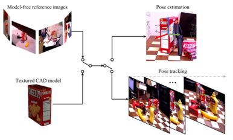
  * results: BOP 1st
    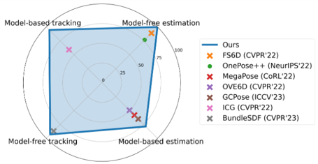
  * method details: 
    * synthetic data generation pipeline
      * assets from Objaverse
      * object texture augmentation by TexFusion, whose text prompt generated by ChatGPT
      * Issac Sim path tracing for scene rendering
    * neural field for model-free setup
      * geometry function as $\Omega: x \rightarrow SDF$
      * appearance function as $\Phi: (f_{\Omega(x)}, n, d) \rightarrow c$
      * train per object, within seconds
      * marching cube to textured mesh as model-based setup
    * pose hypothesis generation
      * MaskRCNN detection
      * initialize translation by median depth of detected 2D bbox
      * initialize rotation by randomly sphere sampling
      * pose refinement network inputs rendered RGBD from pose and real RGBD crop and outputs pose update
    * pose selection
      * network inputs rendered RGBDs from pose and real RGBD crops and outputs scores
    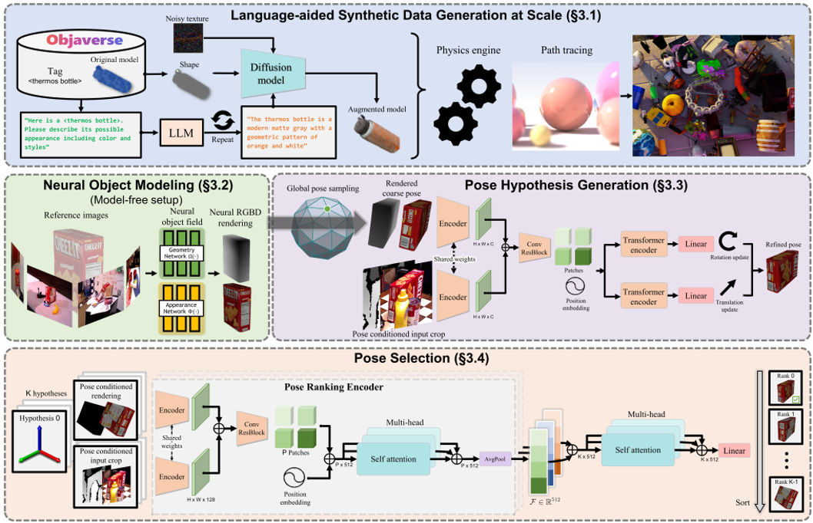

* **Distributed RObot Interaction Dataset** (**DROID**)
  * title and link: [DROID: A Large-Scale In-The-Wild Robot Manipulation Dataset](https://arxiv.org/abs/2403.12945)
  * information: 2024.03.20 Arxiv 15 institutions
  * problem and position: more diverse robot manipulation dataset
  * method overview: collected on a shared platform but distributed places
  * teaser: 
    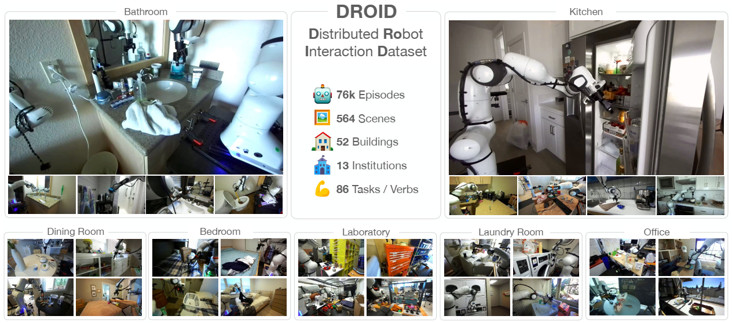
  * results: 
    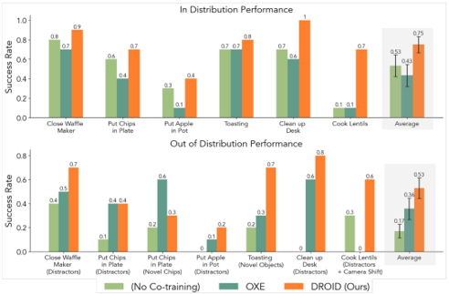
  * method details: 
    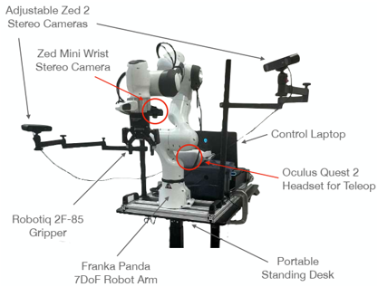
    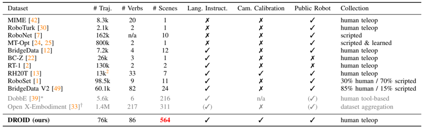
    * better diversity over task, scene, object, viewpoint and interaction point
    * experiment with Diffusion-Policy
    * open-source

* **Dexterous Capture** (**DexCap**)
  * title and link: [DexCap: Scalable and Portable Mocap Data Collection System for Dexterous Manipulation](https://arxiv.org/abs/2403.07788)
  * information: 2024.03.16 RSS 2024 Stanford (Li Fei-Fei)
  * problem and position: scalable and portable data collection system for dexterous manipulation
  * method overview: SLAM camera for tracking wrist and mocap glove for tracking fingers
  * results: 
    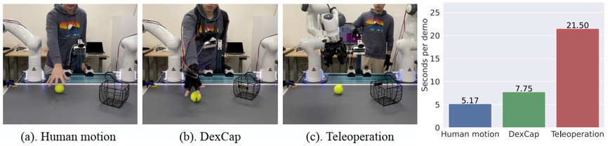
  * method details: 
    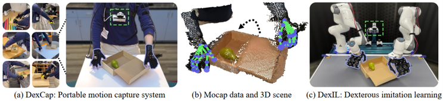
    * teleoperation is hard to scale up
    * vision-based hand tracking is vulnerable to occlusion
    * mocap-EMF glove Rokoko tracking is accurate
    * SLAM-IMU camera T265 tracks wrist pose
    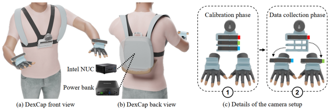
    * IK retargets robotic fingertips to human fingertips
    * forward kinematics insert robot hand point clouds into data
    * point cloud based Diffusion-Policy imitation learning
    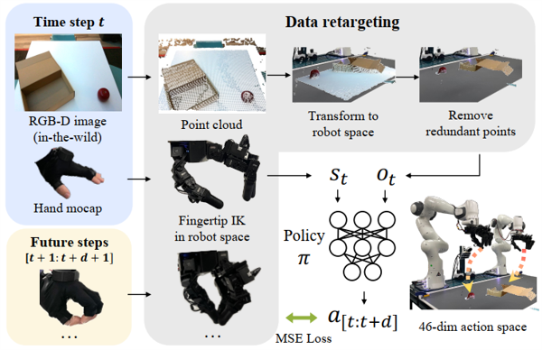

* **Point Transformer V3** (**PTv3**)
  * title and link: [Point Transformer V3: Simpler, Faster, Stronger](https://arxiv.org/abs/2312.10035)
  * information: 2024.03.09 CVPR 2024 oral HKU
  * problem and position: prioritize simplicity and efficiency over intricate model design
  * method overview: simplify some inefficient modules design but with stronger performance
  * results: over 20 downstream tasks SOTA
    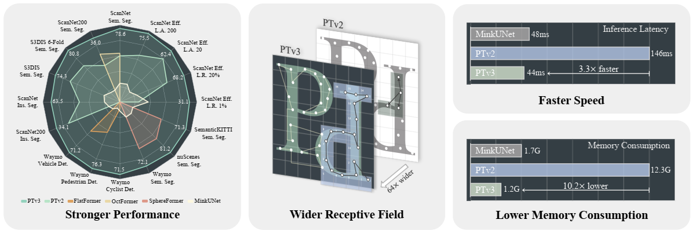
  * method details: 
    * PTv2 has much time on KNN and RPE
      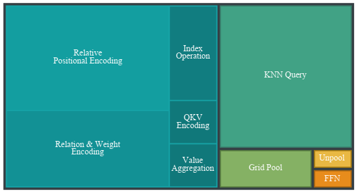
    * instead of previous unordered structure with KNN, serialize point cloud with z-order curve and Hilbert curve, preserving approximate spatial proximity
      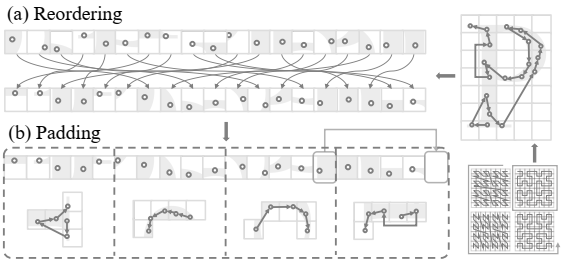
    * patch grouping, patch padding, shuffle order for patch attention
      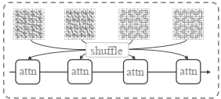
    * instead of previous RPE, enhanced CPE with sparse convolution
    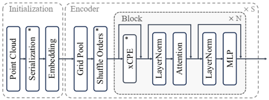

* **Universal Manipulation Interface** (**UMI**)
  * information: 2024.02.15 RSS 2024 outstanding systems paper Stanford (Shuran Song)
  * see [honors](https://github.com/dadadadawjb/honors)

* **Mobile A Low-cost Open-source HArdware system** (**Mobile-ALOHA**)
  * title and link: [Mobile ALOHA: Learning Bimanual Mobile Manipulation with Low-Cost Whole-Body Teleoperation](https://arxiv.org/abs/2401.02117)
  * information: 2024.01.04 Arxiv Stanford (Chelsea Finn)
  * problem and position: learning bimanual mobile manipulation with low-cost whole-body teleoperation
  * method overview: augment ALOHA with a mobile base
  * results: 
    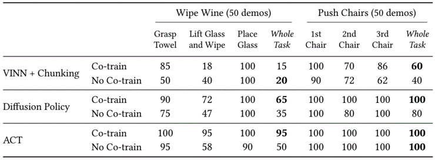
  * method details: 
    * AgileX Tracer AGV as mobile base add to ALOHA
    * experiment with ACT and Diffusion-Policy
    * directly concatenate 14 DoF joint actions with linear and angular velocity of the mobile base forming 16D actions
    * co-training with static ALOHA dataset
    * open-source, cost 32k dollars
    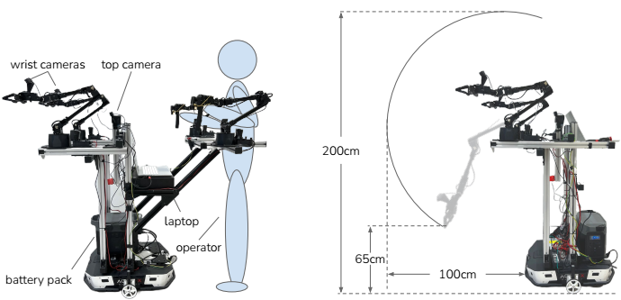
