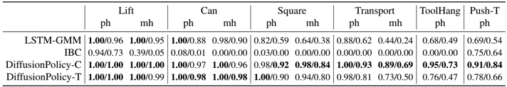
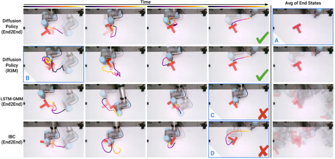
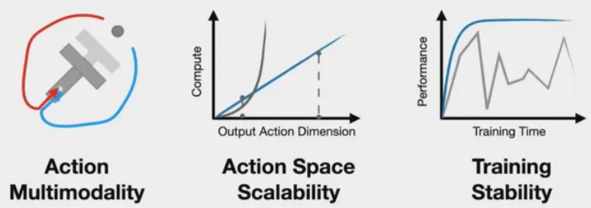
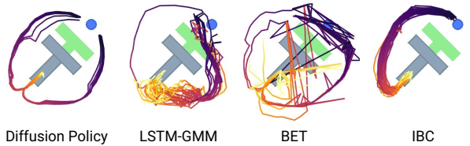
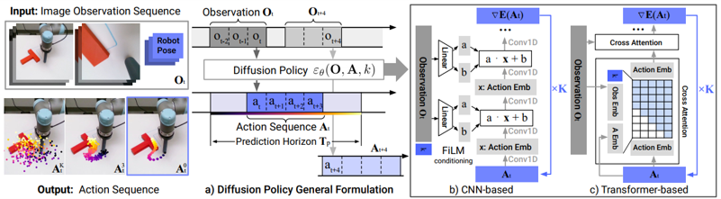

# 2024
* **Foundation Pose** (**FoundationPose**)
  * title and link: [FoundationPose: Unified 6D Pose Estimation and Tracking of Novel Objects](https://arxiv.org/abs/2312.08344)
  * information: 2024.04.04 CVPR 2024 highlight Nvidia
  * problem and position: foundation model for 6D object pose estimation and tracking from RGBD under model-based CAD model or model-free images
  * method overview: large-scale data generation, random pose initialization and pose refinement and pose selection by rendering-and-comparison
  * teaser: 
    
  * results: BOP 1st
    
  * method details: 
    * synthetic data generation pipeline
      * assets from Objaverse
      * object texture augmentation by TexFusion, whose text prompt generated by ChatGPT
      * Issac Sim path tracing for scene rendering
    * neural field for model-free setup
      * geometry function as $\Omega: x \rightarrow SDF$
      * appearance function as $\Phi: (f_{\Omega(x)}, n, d) \rightarrow c$
      * train per object, within seconds
      * marching cube to textured mesh as model-based setup
    * pose hypothesis generation
      * MaskRCNN detection
      * initialize translation by median depth of detected 2D bbox
      * initialize rotation by randomly sphere sampling
      * pose refinement network inputs rendered RGBD from pose and real RGBD crop and outputs pose update
    * pose selection
      * network inputs rendered RGBDs from pose and real RGBD crops and outputs scores
    

* **Dexterous Capture** (**DexCap**)
  * title and link: [DexCap: Scalable and Portable Mocap Data Collection System for Dexterous Manipulation](https://arxiv.org/abs/2403.07788)
  * information: 2024.03.16 Arxiv Stanford Li Fei-Fei
  * problem and position: scalable and portable data collection system for dexterous manipulation
  * method overview: SLAM camera for tracking wrist and mocap glove for tracking fingers
  * results: 
    
  * method details: 
    
    * teleoperation is hard to scale up
    * vision-based hand tracking is vulnerable to occlusion
    * mocap-EMF glove Rokoko tracking is accurate
    * SLAM-IMU camera T265 tracks wrist pose
    
    * IK retargets robotic fingertips to human fingertips
    * forward kinematics insert robot hand point clouds into data
    * point cloud based Diffusion-Policy imitation learning
    

* **Diffusion Policy** (**Diffusion-Policy**)
  * title and link: [Diffusion Policy: Visuomotor Policy Learning via Action Diffusion](https://arxiv.org/abs/2303.04137)
  * information: 2023.12.05 RSS 2023 Columbia Shuran Song
  * problem and position: diffusion model on robotics action imitation learning
  * method overview: empirical attempt for diffusion policy
  * results: 15 tasks from 4 benchmarks in simulation with 46.9% improvement, and many real-world experiments
    
    
  * method details: 
    * diffusion advantages
      * multimodal action distributions
      * high-dimensional action space and sequence
      * stable training
      
    
    * DDPM action sequence with receding-horizon control to maintain temporal consistency
    * visual observation as conditioning
    * Transformer-based
    * position control
    
