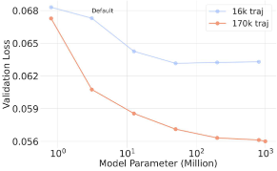
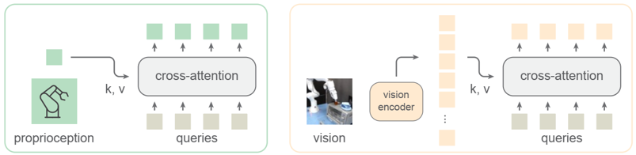

# 2024
* **Physical Intelligence 0** (**$\pi_0$**)
  * title and link: [$π_0$: A Vision-Language-Action Flow Model for General Robot Control](https://arxiv.org/abs/2410.24164)
  * information: 2024.11.01 Arxiv Physical Intelligence (Chelsea Finn, Sergey Levine)
  * problem and position: VLA robot foundation model
  * method overview: pre-trained VLM + flow matching based action module, pre-train and finetune
    
  * teaser: 
    
  * results: 
    
    

* **Data Scaling Laws in Imitation Learning** (**DSL-IL**)
  * title and link: [Data Scaling Laws in Imitation Learning for Robotic Manipulation](https://arxiv.org/abs/2410.18647)
  * information: 2024.10.24 Arxiv Tsinghua (Yang Gao)
  * problem and position: empirical study on data scaling laws in imitation learning
  * method overview: generalization power-law with number of environments and objects, diversity is more important than number of demos and 50 demos per environment-object pair are enough, more diverse environments like 32 and no need for diverse objects in each environment
    
    
    

* **Robotics Diffusion Transformer 1.2B** (**RDT-1B**)
  * title and link: [RDT-1B: a Diffusion Foundation Model for Bimanual Manipulation](https://arxiv.org/abs/2410.07864)
  * information: 2024.10.16 Arxiv Tsinghua (Jun Zhu)
  * problem and position: diffusion foundation model for language-conditioned bimanual manipulation
  * method overview: modified DiT-Policy, pre-train on multi-robot data and fine-tune on self-collected dataset
  * results: 
    
  * method details: 
    
    * low-dimensional proprioception uses MLPs into tokens
    * fill and pad according to the physical meanings for multi-robots
    * frozen SigLIP for images, frozen T5-XXL for languages
    * cross-attention for image and language to condition, and alternate between image and language to avoid over-relying
    * 10% randomly mask modalities to avoid over-relying
    * modified DiT as backbone
    * pre-train on multi-robot data
    * fine-tune on Mobile ALOHA
    * 1.2B parameters, open-source

* **Improved 3D Diffusion Policy** (**iDP3**)
  * title and link: [Generalizable Humanoid Manipulation with Improved 3D Diffusion Policies](https://arxiv.org/abs/2410.10803)
  * information: 2024.10.14 Arxiv Stanford (Yanjie Ze, Jiajun Wu)
  * problem and position: improve DP3
  * method overview: point clouds directly from camera frame, more points to 4096, replace MLP with pyramid CNN, experiment on humanoid robots
  * results: 
    

* **video Generative pre-training for Robot 2** (**GR-2**)
  * title and link: [GR-2: A Generative Video-Language-Action Model with Web-Scale Knowledge for Robot Manipulation](https://arxiv.org/abs/2410.06158)
  * information: 2024.10.10 Arxiv ByteDance (Tao Kong, Hang Li)
  * problem and position: improve GR-1
  * method overview: scale up pre-training data, change ViT to VQGAN for images and MLP to cVAE for robot actions
  * results: 
    
    
    
    

* **Heterogeneous Pre-trained Transformer** (**HPT**)
  * title and link: [Scaling Proprioceptive-Visual Learning with Heterogeneous Pre-trained Transformers](https://arxiv.org/abs/2409.20537)
  * information: 2024.10.01 NeurIPS 2024 spotlight MIT (Kaiming He)
  * problem and position: deal with robot heterogeneity
  * method overview: modularize into embodiment-specific stems, shared trunk and task-specific heads, pre-train and fine-tune
  * results: 
    
    
  * method details: 
    * small proprioception and vision stems use learnable queries cross-attention to map to 16 tokens
      
    * shared trunk but different stems and heads for different robots
      
    * without language as condition
    * pre-train by behavior cloning on Open-X
    * finetune by reinitializing stems and heads but freezing trunk

* **ALOHA Unleashed** (**ALOHA-Unleashed**)
  * title and link: [ALOHA Unleashed: A Simple Recipe for Robot Dexterity](https://arxiv.org/abs/2410.13126)
  * information: 2024.09.12 CoRL 2024 DeepMind (Chelsea Finn)
  * problem and position: improve ALOHA system towards challenging tasks
  * method overview: Transformer-based Diffusion Policy with ALOHA-2 on hanging a shirt, typing shoe laces, replacing robot finger, insert gears, stacking kitchen items
    
  * results: 
    

* **Relational Keypoint Constraints** (**ReKep**)
  * title and link: [ReKep: Spatio-Temporal Reasoning of Relational Keypoint Constraints for Robotic Manipulation](https://arxiv.org/abs/2409.01652)
  * information: 2024.09.06 CoRL 2024 Stanford (Li Fei-Fei)
  * problem and position: represent robotic manipulation as keypoint constraints
  * method overview: use VLMs to propose and write keypoint constraints and then optimize to plan
  * results: 
    
    
  * method details: 
    
    * define constraint as mapping from a set of keypoints to a cost
    * decompose a task into stages
    * sub-goal constraint encodes one keypoint relation to be achieved at the end of the stage
    * path constraint encodes one keypoint relation to be satisfied for every statge within the stage
    * optimize to solve the problem
      
    * DINOv2 with SAM proposes keypoints, GPT-4o writes constraints

* **Theia** (**Theia**)
  * title and link: [Theia: Distilling Diverse Vision Foundation Models for Robot Learning](https://arxiv.org/abs/2407.20179)
  * information: 2024.07.29 CoRL 2024
  * problem and position: distill vision foundation models for robot learning
  * method overview: feature alignment with 5 vision foundation models and empirical study on robot learning
  * teaser: 
    
  * results: 
    
  * method details: 
    
    * visual encoder $z=f(x)$ uses DeiT as backbone from scratch
    * teacher representations $h(x)$ as last layer for CLIP, ViT and DINOv2, before decoder for SAM and Depth-Anything
    * feature translators $g(z)$ as shallow CNNs
    * feature alignment loss as cosine similarity and smooth-L1 loss
      
    * teacher representations normalize to avoid different bias and scales
    * train on ImageNet
    * find that higher entropy in representation norms correlates with better robot learning performance
      

* **UMI on Legs** (**UMI-on-Legs**)
  * title and link: [UMI on Legs: Making Manipulation Policies Mobile with Manipulation-Centric Whole-body Controllers](https://arxiv.org/abs/2407.10353)
  * information: 2024.07.15 CoRL 2024 Stanford (Shuran Song)
  * problem and position: separate task-centric data from robot-centric data
  * method overview: Diffusion Policy learn real-world task-centric data by UMI, WBC learn simulation robot-centric data on quadruped legs
  * teaser: 
    
  * results: 
    
  * method details: 
    
    * task-centric data should not mix with robot-centric data
    * high-level manipulation policy outputs end-effector trajectory in camera frame with wrist-mounted visual inputs, low-level whole-body controller controls to track the trajectory
      
    * task-centric data from UMI in real world, learned by Diffusion Policy
    * robot-centric data in simulation, learned by MLP RL, no need for setting up diverse environments

* **Depth Anything V2** (**Depth-Anything-V2**)
  * title and link: [Depth Anything V2](https://arxiv.org/abs/2406.09414)
  * information: 2024.06.13 NeurIPS 2024 HKU (Hengshuang Zhao)
  * problem and position: improve Depth-Anything fine details and robustness of materials
  * method overview: train larger teacher model on labeled synthetic images, then learn student model on pseudo-labeled real images
  * teaser: 
    
  * results: 
    
    
  * method details: 
    
    
    * labeled real images have inaccurate depth maps and ignored details, leading to over-smoothed predictions
      * teacher model trains on 595K synthetic images from 5 datasets
    * synthetic images have truly GT depth maps, but exist distribution shift and restricted scene coverage
      * scale up teacher model to DINOv2-G to expect generalization
      * train student model on 62M pseudo-labeled real images from 8 datasets
    * real images benchmarks also inaccurate
      * DA-2K: 2K sparse relative depth pairs on 1K real images
      * annotate by 4 models vote and human annotate
      

* **Foundation Pose** (**FoundationPose**)
  * title and link: [FoundationPose: Unified 6D Pose Estimation and Tracking of Novel Objects](https://arxiv.org/abs/2312.08344)
  * information: 2024.04.04 CVPR 2024 highlight Nvidia
  * problem and position: foundation model for 6D object pose estimation and tracking from RGBD under model-based CAD model or model-free images
  * method overview: large-scale data generation, random pose initialization and pose refinement and pose selection by rendering-and-comparison
  * teaser: 
    
  * results: BOP 1st
    
  * method details: 
    * synthetic data generation pipeline
      * assets from Objaverse
      * object texture augmentation by TexFusion, whose text prompt generated by ChatGPT
      * Issac Sim path tracing for scene rendering
    * neural field for model-free setup
      * geometry function as $\Omega: x \rightarrow SDF$
      * appearance function as $\Phi: (f_{\Omega(x)}, n, d) \rightarrow c$
      * train per object, within seconds
      * marching cube to textured mesh as model-based setup
    * pose hypothesis generation
      * MaskRCNN detection
      * initialize translation by median depth of detected 2D bbox
      * initialize rotation by randomly sphere sampling
      * pose refinement network inputs rendered RGBD from pose and real RGBD crop and outputs pose update
    * pose selection
      * network inputs rendered RGBDs from pose and real RGBD crops and outputs scores
    

* **Distributed RObot Interaction Dataset** (**DROID**)
  * title and link: [DROID: A Large-Scale In-The-Wild Robot Manipulation Dataset](https://arxiv.org/abs/2403.12945)
  * information: 2024.03.20 RSS 2024 15 institutions
  * problem and position: more diverse robot manipulation dataset
  * method overview: collected on a shared platform but distributed places
  * teaser: 
    
  * results: 
    
  * method details: 
    
    
    * better diversity over task, scene, object, viewpoint and interaction point
    * experiment with Diffusion-Policy
    * open-source

* **Dexterous Capture** (**DexCap**)
  * title and link: [DexCap: Scalable and Portable Mocap Data Collection System for Dexterous Manipulation](https://arxiv.org/abs/2403.07788)
  * information: 2024.03.16 RSS 2024 Stanford (Li Fei-Fei)
  * problem and position: scalable and portable data collection system for dexterous manipulation
  * method overview: SLAM camera for tracking wrist and mocap glove for tracking fingers
  * results: 
    
  * method details: 
    
    * teleoperation is hard to scale up
    * vision-based hand tracking is vulnerable to occlusion
    * mocap-EMF glove Rokoko tracking is accurate
    * SLAM-IMU camera T265 tracks wrist pose
    
    * IK retargets robotic fingertips to human fingertips
    * forward kinematics insert robot hand point clouds into data
    * point cloud based Diffusion-Policy imitation learning
    

* **Point Transformer V3** (**PTv3**)
  * title and link: [Point Transformer V3: Simpler, Faster, Stronger](https://arxiv.org/abs/2312.10035)
  * information: 2024.03.09 CVPR 2024 oral HKU
  * problem and position: prioritize simplicity and efficiency over intricate model design
  * method overview: simplify some inefficient modules design but with stronger performance
  * results: over 20 downstream tasks SOTA
    
  * method details: 
    * PTv2 has much time on KNN and RPE
      
    * instead of previous unordered structure with KNN, serialize point cloud with z-order curve and Hilbert curve, preserving approximate spatial proximity
      
    * patch grouping, patch padding, shuffle order for patch attention
      
    * instead of previous RPE, enhanced CPE with sparse convolution
    

* **3D Diffusion Policy** (**DP3**)
  * title and link: [3D Diffusion Policy: Generalizable Visuomotor Policy Learning via Simple 3D Representations](https://arxiv.org/abs/2403.03954)
  * information: 2024.03.06 RSS 2024 Tsinghua (Yanjie Ze, Huazhe Xu)
  * problem and position: combine 3D point cloud with diffusion policy
  * method overview: simply MLP+pooling to encode point cloud
  * results: 24.2% relative improvement on 72 simulation tasks, 85% success rate absolutely on 4 real tasks
    
  * method details: 
    
    * point clouds from 84x84 single-view depth camera without RGB
    * 3 layers of MLPs followed by max pooling as encoder
      
    * others the same as Diffusion-Policy
    * find that 1024 point cloud is better than image, also than depth and voxel
      
    * find that MLP is better than PointNet, even than PointTransformer
      
    * many experiments validate

* **Universal Manipulation Interface** (**UMI**)
  * information: 2024.02.15 RSS 2024 outstanding systems paper Stanford (Shuran Song)
  * see [honors](https://github.com/dadadadawjb/honors)

* **An enhanced Low-cost Open-source HArdware** (**ALOHA-2**)
  * title and link: [ALOHA 2: An Enhanced Low-Cost Hardware for Bimanual Teleoperation](https://arxiv.org/abs/2405.02292)
  * information: 2024.02.09 Arxiv DeepMind (Chelsea Finn)
  * problem and position: improve performance of bimanual teleoperation
  * method overview: mainly add passive gravity compensation and MuJoCo simulation
    
  * results: more user-friendly

* **Depth Anything** (**Depth-Anything**)
  * title and link: [Depth Anything: Unleashing the Power of Large-Scale Unlabeled Data](https://arxiv.org/abs/2401.10891)
  * information: 2024.01.19 CVPR 2024 HKU (Hengshuang Zhao)
  * problem and position: foundation model for monocular depth estimation
  * method overview: scale up with large-scale unlabeled images and initialize by few labeled images with teacher-student, student adds strong data augmentation and DINOv2 feature alignment loss
  * results: 
    
  * method details: 
    * learn teacher model from 1.5M labeled images from 6 datasets like MiDaS, assign pseudo depth labels for 62M unlabeled images from 8 datasets, then train student model on mixture
      
    * no improvement directly train on mixture
      * add color jitter and Gaussian blur and CutMix augmentation to challenge additional knowledge
    * no improvement adding segmentation loss
      * add cosine similarity feature alignment with DINOv2 loss to import richer semantic information

* **Mobile A Low-cost Open-source HArdware system** (**Mobile-ALOHA**)
  * title and link: [Mobile ALOHA: Learning Bimanual Mobile Manipulation with Low-Cost Whole-Body Teleoperation](https://arxiv.org/abs/2401.02117)
  * information: 2024.01.04 CoRL 2024 Stanford (Chelsea Finn)
  * problem and position: learning bimanual mobile manipulation with low-cost whole-body teleoperation
  * method overview: augment ALOHA with a mobile base
  * results: 
    
  * method details: 
    * AgileX Tracer AGV as mobile base add to ALOHA
    * experiment with ACT and Diffusion-Policy
    * directly concatenate 14 DoF joint actions with linear and angular velocity of the mobile base forming 16D actions
    * co-training with static ALOHA dataset
    * open-source, cost 32k dollars
    
